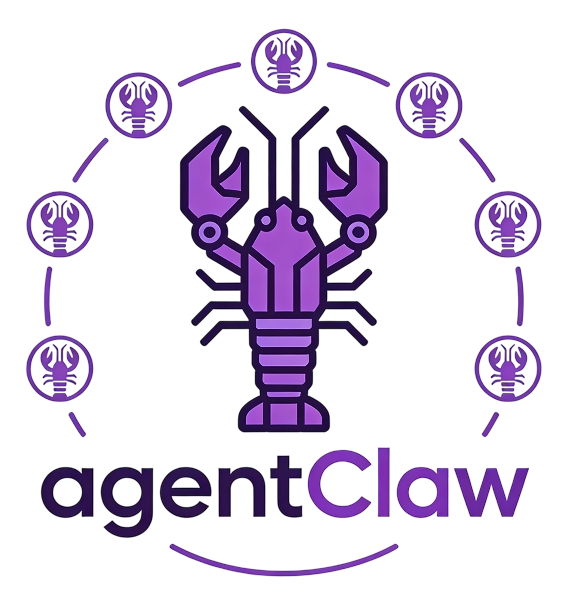
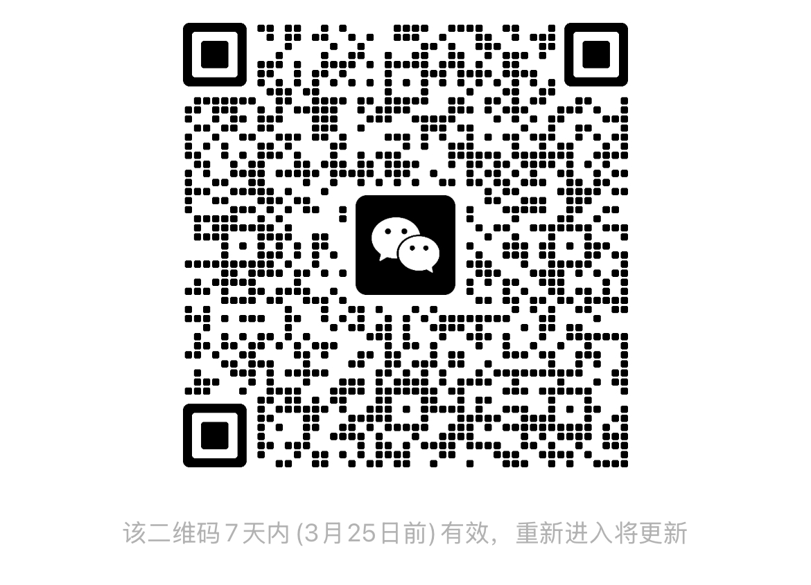

# AgentClaw - OpenClaw Multi-User Agent Platform (for Small Teams)



[中文版 README](README_CN.md)

Upgrade **OpenClaw's single-user agents** into a **multi-user agent platform** with a unified entry, user isolation, shared instances, dynamic sandboxes, and security governance. Built for small teams to spin up an internal agent platform quickly.

**AgentClaw** provides multi-user agent runtime and governance. Each user runs their own agent sessions and workflows inside an isolated Docker sandbox.

Powered by the **frameClaw** multi-tenant architecture — shared instances plus dynamic sandboxes for tenant isolation on top of OpenClaw.

## Key Features

- **🧩 Multi-User Agent Platform** - Unified entry for small teams, user isolation, agent lifecycle management
- **🐳 Strict Sandbox Isolation** - Per-user Docker containers with preinstalled Python/Node/toolchains
- **🌐 Network Access** - API calls, package installs, web crawling supported
- **🔒 Security Governance** - Automated security checks and least-privilege capabilities
- **📦 Asset Reuse** - Skills/workflows/tools can be reused and shared across the platform
- **🔌 Zero-Intrusion Integration** - No OpenClaw source modifications; multi-user via Bridge layer

## Architecture

AgentClaw uses the **frameClaw** multi-tenant architecture: shared instances + dynamic sandboxes:

```
┌─────────────────────────────────────────────────────────────────┐
│                          User Browser                            │
│                   Frontend (React + Vite)                        │
└───────────────────────────┬─────────────────────────────────────┘
                            │ HTTP / WebSocket
┌───────────────────────────▼─────────────────────────────────────┐
│                    Platform Gateway                              │
│                   FastAPI + PostgreSQL                           │
│  ┌─────────────┐  ┌─────────────┐  ┌─────────────────────────┐  │
│  │  JWT Auth   │  │  LLM Proxy  │  │ Shared Instance Manager │  │
│  └─────────────┘  └─────────────┘  └─────────────────────────┘  │
└───────────────────────────┬─────────────────────────────────────┘
                            │
┌───────────────────────────▼─────────────────────────────────────┐
│                  OpenClaw Shared Instance                        │
│  ┌─────────────────────────────────────────────────────────┐    │
│  │  Bridge (HTTP API)  ◄──►  OpenClaw Gateway (Agent Engine)│    │
│  └─────────────────────────────────────────────────────────┘    │
│                              │                                  │
│         ┌────────────────────┼────────────────────┐             │
│         │                    │                    │             │
│    ┌────▼────┐         ┌────▼────┐         ┌────▼────┐        │
│    │ Sandbox │         │ Sandbox │         │ Sandbox │        │
│    │ User A  │         │ User B  │         │ main    │        │
│    └─────────┘         └─────────┘         └─────────┘        │
└─────────────────────────────────────────────────────────────────┘
```

### Zero-Intrusion Integration

frameClaw **does not modify OpenClaw source**. Multi-tenancy is achieved through a Bridge adapter layer:

```
OpenClaw (upstream)
    │
    │ Native WebSocket / RPC
    │
    ▼
Bridge (adapter) ───► HTTP API + multi-tenant routing
    │
    │ Config injection
    │
    ▼
Platform Gateway (auth/proxy)
```

**Bridge responsibilities:**
- Convert OpenClaw WebSocket RPC to REST APIs
- Inject multi-tenant config (`X-Agent-Id` routing)
- Manage per-agent workspace directories
- Forward LLM requests to the Platform Gateway

This lets AgentClaw track upstream OpenClaw updates without maintaining a fork.

### Multi-Agent Design

OpenClaw supports multiple agents natively. AgentClaw uses that to achieve tenant isolation:

| Concept | Description |
|------|------|
| Agent ID | Unique user identifier (e.g. `08f95579-5ad0-48f6-a945-1233309a4fc0`) |
| Workspace | Per-agent directory `~/.openclaw/workspace-{agentId}/` |
| Sandbox | Docker container created on demand; destroyed after execution |
| Session | Routed as `agent:{agentId}:{sessionKey}` |

### Sandbox Configuration

Default sandbox image config:

```json
{
  "sandbox": {
    "mode": "all",           // all sessions use sandbox
    "scope": "agent",        // per-agent sandbox
    "workspaceAccess": "rw", // read/write workspace
    "docker": {
      "image": "openclaw-sandbox:agentclaw",
      "readOnlyRoot": false,
      "network": "bridge",
      "user": "0:0",
      "memory": "2g",
      "cpus": 2,
      "pidsLimit": 256,
      "capDrop": ["ALL"]
    }
  }
}
```

## Quick Start (Run AgentClaw)

Built for small teams: this repo provides a ready-to-run multi-user agent platform example.

### Requirements

- Docker & Docker Compose
- At least one LLM API key (Anthropic/OpenAI/DashScope, etc.)

### Setup

```bash
cp .env.example .env
# edit .env and add LLM API keys
```

### Run

```bash
# optional: environment check
python prepare.py

# build (if needed) and start services
# first run (or when Dockerfile/source changed)
docker compose up -d --build
# if images are already built
docker compose up -d
```

Visit http://127.0.0.1:3080

## Deployment Notes

- AgentClaw is **based on the official OpenClaw packages** and **does not require any OpenClaw source modifications**.
- You can deploy directly with Docker Compose; `--build` ensures images are rebuilt when Dockerfiles or source change.
- `prepare.py` helps validate Docker and `.env` before starting.
- User files are persisted on the host (for example `~/.openclaw` and Docker volumes). Removing those will delete data.
- Default OpenClaw version is **2026.3.8** (build arg `OPENCLAW_VERSION`). To change it, set `OPENCLAW_VERSION` in `.env` and rerun `docker compose up -d --build`.

## Platform Usage (Skills Are Only One Part)

### 1. Create a Skill (Reusable Asset)

```
skills/
└── my-skill/
    ├── SKILL.md          # description, triggers, usage
    ├── scripts/
    │   └── main.py       # executable script
    └── references/       # references
```

### 2. Sandbox Testing (Unified Runtime)

Agent executes scripts inside the sandbox:

```bash
# install deps
apt-get update && apt-get install -y some-package
pip install requests

# run test
timeout 30 python3 scripts/main.py
```

### 3. Security Review (Platform Governance)

Creating/updating a skill triggers automated security checks.

### 4. Share & Install (Asset Distribution)

- Submit to the curated skill library
- Other users can install into any agent with one click

## Project Structure

```
.
├── bridge/              # Bridge adapter - frameClaw core (Node.js)
│   ├── config.ts        # OpenClaw multi-tenant config generation
│   ├── server.ts        # HTTP API + WebSocket relay
│   └── routes/          # Agents, Skills, Files APIs
│
├── platform/            # Platform gateway (Python FastAPI)
│   ├── auth.py          # JWT auth + agent lifecycle
│   ├── proxy.py         # Route requests to shared instance
│   └── shared_manager.py # Shared OpenClaw instance manager
│
├── frontend/            # Web frontend (React + Vite)
│   └── pages/           # Chat, Agents, Skills, FileManager
│
├── sandbox/             # Sandbox image Dockerfile
│   └── Dockerfile       # Multi-user agent execution environment
│
└── docker-compose.yml   # Multi-service composition
```

## Security Design

| Layer | Measure |
|------|------|
| API Key Isolation | All LLM API keys live only in Gateway env vars |
| Sandbox Execution | Code runs in Docker with resource limits, no escape |
| File Isolation | Per-user workspace; cross-user access blocked |
| Network Isolation | Outbound allowed; inbound blocked |
| Capability Limits | `capDrop: ALL`, optional read-only root |

## Highlights

AgentClaw architecture highlights:

- **Zero-Intrusion Integration** - No OpenClaw source changes; Bridge adapter only
- **Shared Instance** - Single OpenClaw Gateway serving multiple users efficiently
- **Dynamic Sandbox** - On-demand Docker environments
- **Security Isolation** - JWT auth, API key proxying, filesystem isolation

This architecture can be adapted to other agent engines for internal agent platforms or multi-tenant AI platforms.


## Contact

- WeChat: `wdyt1008521`
- Email: `wuding129@163.com`
- WeChat Group QR:



## License

MIT
